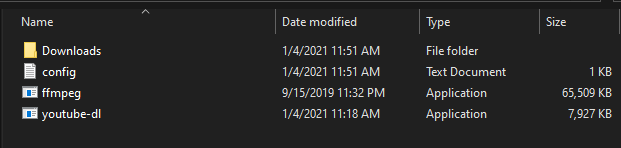

# YoutubeDL - Youtube Downloader Script (Windows Only)
Script for downloading youtube video to MP3 320kbps playlist easily.

### Follow below steps to make it work!
1. Download it.
2. Place in one folder except system32.
3. Create folder "Downloads" on current directory.
4. Unzip ffmpeg.zip file and place in exact same directory.
5. Open config.txt file replace youtube url with your youtube playlist url
6. Fire that command in CMD on current directory.
7. All video will auto convert to mp3 (320kbps) and will be placed in Downloads folder.
8. Done.

### Example

### For Developer
If you're developer you can direclty use the python script /download.py file and execute it in local system, you'll asked to enter the youtube playlist url make sure you already have the `yt-dlp` installed in your system, Enjoy!

### For more info visit:
https://github.com/ytdl-org/youtube-dl
